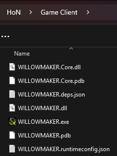
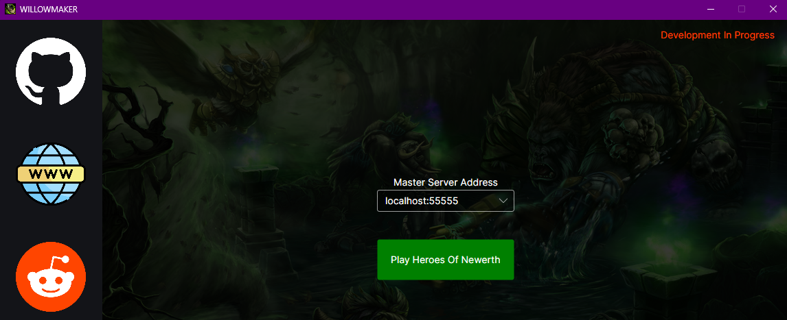

<h3>
    <p align="center">WILLOWMAKER</p>
    <p>Heroes Of Newerth client launcher to connect to the Project KONGOR services.</p>
    <p>If you would like to support the development of this project and buy me a coffee, please consider one of the following options: <a href="https://github.com/sponsors/K-O-N-G-O-R">GitHub Sponsors</a>, <a href="https://paypal.me/MissingLinkMedia">PayPal</a>. 💚</p>
</h3>

<hr/>

<br/>

## 🛠️ Build & Deployment Guide

This guide describes how to build the Client (`WILLOWMAKER.exe`) from source and deploy it to your Heroes of Newerth game installation.

### 📋 Prerequisites

*   **.NET SDK**: Ensure you have the .NET SDK installed (Release 10.0 or newer).
    *   [Download .NET SDK](https://dotnet.microsoft.com/download)


### 🚀 Quick Deployment Script

You can use the following PowerShell snippet to build and deploy in one step.
**Important:** Open your terminal in the repository root (where `WILLOWMAKER.slnx` is located).

**Just update the `$GameClientDir` variable!**

```powershell
# --- CONFIGURATION ---
$GameClientDir = "C:\Games\Heroes of Newerth" # <--- REPLACE THIS WITH YOUR FOLDER

# --- CHECK DIRECTORY ---
if (-not (Test-Path ".\WILLOWMAKER.slnx")) {
    Write-Error "❌ Wrong Directory! Please run this from the repository root (where WILLOWMAKER.slnx is)."
    return
}

# --- BUILD & DEPLOY ---
Write-Host "Building WILLOWMAKER..."
dotnet build -c Release

Write-Host "Deploying to $GameClientDir..."
$BuildDir = ".\WILLOWMAKER\bin\Release\net10.0"

if (Test-Path $BuildDir) {
    Copy-Item -Path "$BuildDir\*" -Destination $GameClientDir -Recurse -Force
    Write-Host "✅ Deployment Complete!" -ForegroundColor Green
    Write-Host "You can now run WILLOWMAKER.exe from: $GameClientDir"
} else {
    Write-Host "❌ Build failed or path not found: $BuildDir" -ForegroundColor Red
}
```

<br/>


<br/>

### 🛠️ Manual Build & Deployment (Alternative)

If you prefer to run the steps manually:

1.  **Build**:
    ```powershell
    dotnet build -c Release
    ```
2.  **Locate Artifacts**:
    *   Navigate to: `.\WILLOWMAKER\bin\Release\net10.0`
3.  **Copy**:
    *   Copy **ALL** contents to your game folder ensuring you overwrite existing files in your Game Client folder.



<br/>

### 🎮 How to Play

1.  **Launch Client**: Open the game client folder you deployed to and run `WILLOWMAKER.exe`.
2.  **Connect**:
    *   **Online Play**: Enter the Master Server URL provided by your community.
    *   **Local Testing**: Choose **Local** mode to connect to your local development environment.


